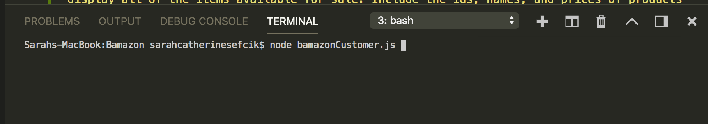
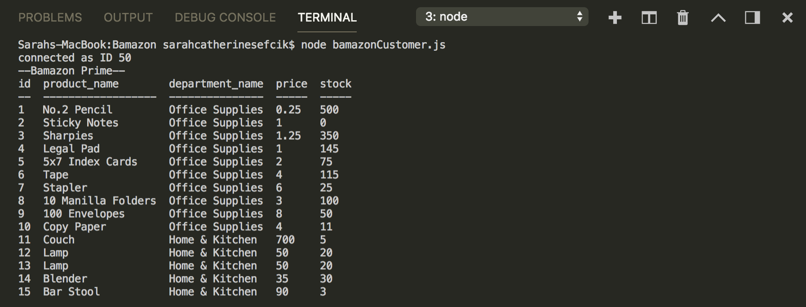
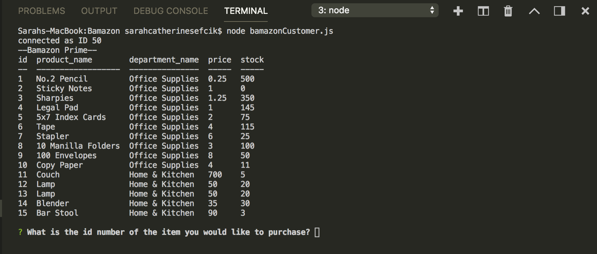
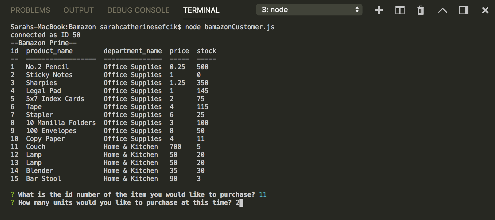
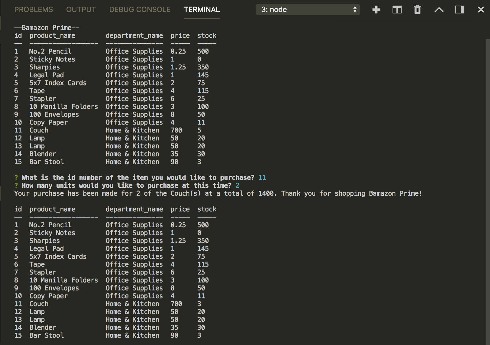
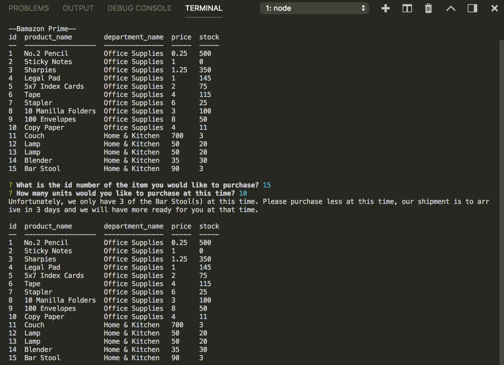

# Bamazon

1. Create a MySQL Database called `bamazon`. Bamazon will be similar to an Amazon type of account. The database will store products while customers will be able to "purchase" said products.

2. Then create a Table inside of that database called `products`, with each of the following columns:
   * item_id (unique id for each product)
   * product_name (Name of product)
   * department_name
   * price (cost to customer)
   * stock_quantity (how much of the product is available in stores)

4. Populate this database with around 10 different products.(i.e. "mock" data)

5. Then create a Node application called `bamazonCustomer.js`. Run the application to first display all of the items available for sale. Include the ids, names, and prices of products for sale.

6. Next, prompt users with two messages.
   a. The first should ask them the ID of the product they would like to buy.
   b. The second message should ask how many units of the product they would like to buy.

7. Once the customer has placed the order, your application should check if your store has enough of the product to meet the customer's request.

   * If not, the app should log a phrase and prevent the order from going through.

8. However, if your store _does_ have enough of the product, you should fulfill the customer's order.
   * This means updating the SQL database to reflect the remaining quantity.
   * Once the update goes through, show the customer the total cost of their purchase.

